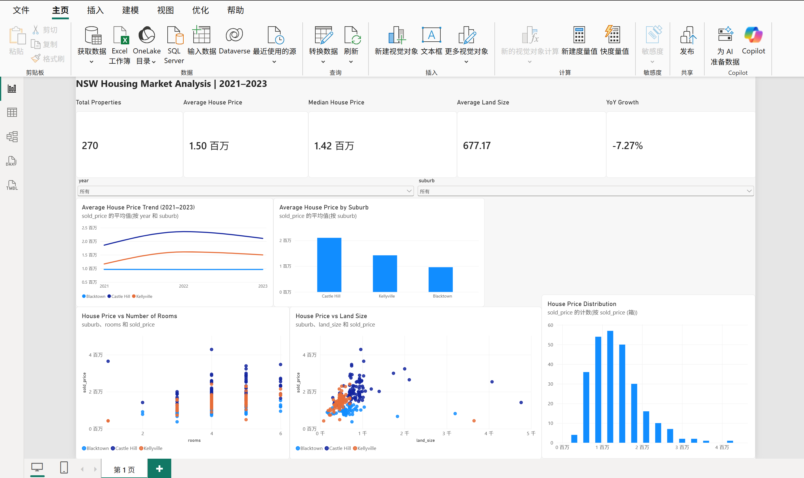

NSW Housing Market Analysis & Development Recommendation

Project Overview

This personal data analytics portfolio project analyses residential property data from Kellyville, Blacktown and Castle Hill, NSW, covering 2021–2023.

The objective is to compare affordability, price stability, property characteristics and market trends in order to support an initial mid-market residential development screening decision.

The cleaned dataset contains 270 usable property records, with 30 observations for each suburb-year combination.

Business Question

Which of the three suburbs — Kellyville, Blacktown or Castle Hill — is the strongest candidate for an initial mid-market residential development strategy?

Tools Used

- MySQL
- Python
- Pandas
- NumPy
- Matplotlib
- Statsmodels
- Power BI

Project Workflow

1. SQL data validation and querying
2. Data quality checks
3. Aggregation and ranking
4. Year-on-year growth analysis
5. Python data cleaning and exploratory data analysis
6. Descriptive statistics and coefficient of variation
7. Correlation analysis
8. Multiple linear regression
9. Power BI dashboard development
10. Business insight and development recommendation

SQL Analysis

The SQL workflow includes:

- Data import validation
- Missing-value checks
- Duplicate checks
- Invalid-value checks
- Average house price by suburb and year
- Sample counts
- Room-count and average-price analysis
- Ranking with window functions
- Year-on-year growth using CTE, "LAG()" and "CASE WHEN"
- Land-size segmentation using "NTILE()"
- Macroeconomic data integration using "LEFT JOIN"
- Final yearly suburb ranking

Python Analysis

Python was used to independently rebuild the analytical workflow, including:

- Data validation
- Data-type correction
- Outlier detection using the IQR method
- Descriptive statistics
- Coefficient of variation
- Grouped analysis
- Price trend analysis
- Cross-suburb comparison
- House-price distribution analysis
- Correlation analysis
- Macroeconomic data merging
- Multiple linear regression

## Power BI Dashboard

An interactive Power BI dashboard was developed to display:

- Total property records
- Average house price
- Median house price
- Average land size
- Year-on-year growth
- House-price trends from 2021–2023
- Average price by suburb
- House price vs number of rooms
- House price vs land size
- House-price distribution
- Interactive filters for year and suburb

## Key Business Insights

1. Blacktown offers the strongest affordability and stability combination

In 2023, Blacktown recorded an average house price of approximately AUD 962,252, compared with approximately AUD 1.50 million in Kellyville and AUD 2.11 million in Castle Hill.

Blacktown also had the lowest 2023 coefficient of variation at 0.1829, indicating stronger relative price stability.

This makes Blacktown the strongest initial candidate for a mid-market residential development screening.

2. Castle Hill represents a premium market with a higher entry cost

Castle Hill consistently recorded the highest average house prices among the three suburbs.

This indicates a premium market position, but also a substantially higher entry cost, making it less suitable for an affordability-focused mid-market strategy.

3. Kellyville shows stronger growth potential but greater short-term fluctuation

Kellyville experienced strong price growth from 2021 to 2022 before declining in 2023.

This suggests stronger growth potential than Blacktown, but also greater short-term market uncertainty.

4. Room count is a stronger price-related factor than marginal land size in Blacktown

The Blacktown multiple regression indicates that one additional room is associated with approximately AUD 94,862 higher sale price, while land size is not statistically significant after controlling for room count.

This suggests that functional housing configuration may be more important than simply increasing land size within this sample.

5. Average land size should not be interpreted in isolation

Several unusually large land parcels remain in the dataset.

These observations can distort average land-size statistics, so median values and the overall distribution should also be considered.

Recommendation

Blacktown is recommended for initial mid-market residential development screening because it combines lower entry prices with stronger relative price stability.

This should not be interpreted as a final investment decision. A full feasibility study would require additional information such as zoning rules, construction costs, land availability, transport access, environmental constraints and project finance assumptions.

Repository Structure

NSW-Housing-Market-Analysis/
│
├── README.md
├── sql/
│   └── NSW_Housing_Analysis_Portfolio_FINAL.sql
│
├── python/
│   └── NSW_Housing_Python_Analysis_FINAL.ipynb
│
├── powerbi/
│   └── NSW_Housing_Dashboard_FINAL.pbix
│
├── images/
│   └── dashboard.png
│
└── data/
    └── NSW_Housing_PowerBI.xlsx

Project Note

The original dataset and business context originated from a university Business Statistics group assignment.

The SQL, Python and Power BI workflow presented in this repository was independently rebuilt and reorganised as a personal data analytics portfolio project.
